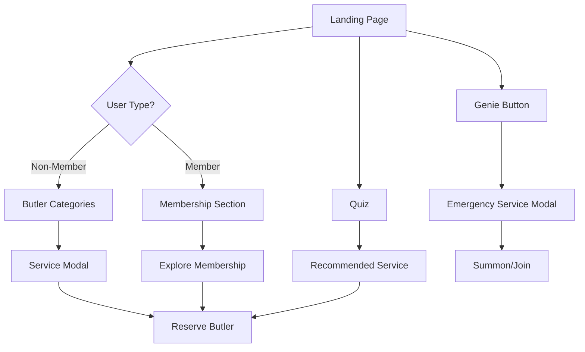

# Butlers Inc. Product Requirements Document

> Comprehensive PRD derived from codebase analysis.
> **Version:** 1.0 • **Generated:** February 2026

---

## Table of Contents

1. [Product Overview](#product-overview)
2. [Technical Architecture](#technical-architecture)
3. [File Structure](#file-structure)
4. [Page Inventory](#page-inventory)
5. [Feature Specifications](#feature-specifications)
6. [Data Requirements](#data-requirements)
7. [Future Considerations](#future-considerations)

---

## Product Overview

### Executive Summary

**Butlers Inc.** is a premium personal concierge platform offering on-demand butler services across England. The website serves as the primary customer acquisition and booking interface, positioning the brand as a sophisticated, trustworthy alternative to traditional errand services.

### Inferred Purpose & Goals

| Goal | Evidence in Codebase |
|------|---------------------|
| **Customer Acquisition** | Hero CTA, service showcase, testimonials |
| **Service Education** | Six butler categories with detailed examples |
| **Membership Conversion** | Side-by-side PAYG vs Membership comparison |
| **Trust Building** | Trust & Safety section, body-cam messaging, DBS checks |
| **Booking Facilitation** | "Reserve this Butler" CTAs, sticky booking bar |

### Target Market

Based on service definitions and messaging:

1. **Busy Professionals** — C-suite, entrepreneurs needing urgent logistics
2. **Parents & Families** — School runs, childcare, elderly welfare checks
3. **High-Net-Worth Individuals** — Luxury sourcing, VIP experiences
4. **Property Owners** — Key holding, tradesman coordination
5. **Budget-Conscious Users** — Flexible timing for non-urgent tasks

### Business Model

```
┌─────────────────────────────────────────────────────────────────┐
│                      REVENUE STREAMS                            │
├─────────────────────────────────────────────────────────────────┤
│  PAY AS YOU GO (PAYG)         │  MEMBERSHIP TIERS              │
│  - No commitment              │  - Light: 3 credits, 10% off   │
│  - Transparent pricing        │  - Standard: 8 credits, 15% off│
│  - From £20/hr               │  - Premium: 15 credits, 20% off│
│                               │  + Genie allowance per tier    │
│                               │  + Priority access             │
└─────────────────────────────────────────────────────────────────┘
```

### Key User Flows



---

## Technical Architecture

### Tech Stack

| Layer | Technology | Version | Purpose |
|-------|------------|---------|---------|
| **Runtime** | Node.js | 18+ | JavaScript runtime |
| **Build Tool** | Vite | 5.4 | Fast dev server, HMR, bundling |
| **Framework** | React | 18.3 | UI library with concurrent rendering |
| **Language** | TypeScript | 5.8 | Type-safe development |
| **Styling** | Tailwind CSS | 3.4 | Utility-first CSS |
| **UI Components** | shadcn/ui | — | Radix-based accessible components |
| **Routing** | React Router | 6.30 | Client-side routing |
| **Forms** | React Hook Form | 7.61 | Performant form management |
| **Validation** | Zod | 3.25 | Schema validation |
| **State** | TanStack Query | 5.83 | Async state management |
| **Animation** | Framer Motion | 12.29 | Animation library |
| **Testing** | Playwright | 1.57 | E2E testing |

### Styling Architecture

```
┌─────────────────────────────────────────────────────────────────┐
│                      STYLING LAYERS                              │
├─────────────────────────────────────────────────────────────────┤
│  src/index.css                                                   │
│  └── CSS Custom Properties (design tokens)                      │
│  └── @tailwind base/components/utilities                        │
│  └── Custom utility classes (.section-padding, .hero-overlay)   │
│                                                                  │
│  tailwind.config.ts                                              │
│  └── Font families (Cormorant Garamond, Inter)                  │
│  └── Extended colors (brass, cream, charcoal, etc.)             │
│  └── Custom animations (fade-up, fade-in, accordion)            │
│  └── Border radius variations                                   │
│                                                                  │
│  src/components/ui/*.tsx                                         │
│  └── shadcn/ui component implementations                        │
│  └── Component-level styling via className                      │
└─────────────────────────────────────────────────────────────────┘
```

### Key Dependencies

| Package | Purpose |
|---------|---------|
| `@radix-ui/*` | Accessible UI primitives (20+ packages) |
| `class-variance-authority` | Component variant management |
| `clsx` + `tailwind-merge` | Conditional class merging |
| `lucide-react` | Icon library |
| `embla-carousel-react` | Carousel functionality |
| `react-day-picker` | Date selection |
| `sonner` | Toast notifications |
| `vaul` | Drawer component |
| `next-themes` | Theme management (dark mode support) |
| `recharts` | Charts (available but not currently used) |

### Build Configuration

```typescript
// vite.config.ts
export default defineConfig({
  plugins: [react()],
  resolve: {
    alias: {
      "@": path.resolve(__dirname, "./src"),
    },
  },
});
```

**Path Aliases:**
- `@/` → `./src/`
- Example: `import { Button } from "@/components/ui/button"`

---

## File Structure

```
butler-inc-concierge/
├── public/
│   ├── favicon.ico                    # ICO favicon
│   ├── favicon.png                    # PNG favicon (310KB)
│   ├── placeholder.svg                # Placeholder image
│   ├── robots.txt                     # SEO robots configuration
│   └── images/
│       ├── butlers-inc-logo.webp      # Light bg logo (15KB)
│       ├── butler-inc-trans-logo.webp # Dark bg transparent logo (20KB)
│       ├── hero-butler.png            # Hero background (737KB)
│       ├── busy-butler.png            # Service images (535-911KB each)
│       ├── baby-butler.png
│       ├── bougie-butler.png
│       ├── base-butler.png
│       ├── budget-butler.png
│       └── bespoke-butler.png
│
├── src/
│   ├── main.tsx                       # Application entry point
│   ├── App.tsx                        # Root component with routing
│   ├── index.css                      # Global styles & design tokens
│   ├── vite-env.d.ts                  # Vite type declarations
│   │
│   ├── components/
│   │   ├── NavLink.tsx                # Shared navigation link
│   │   │
│   │   ├── landing/                   # 16 Landing page components
│   │   │   ├── Header.tsx             # Fixed navigation header
│   │   │   ├── Hero.tsx               # Hero section with segmented control
│   │   │   ├── ButlerCategoryGrid.tsx # 6-butler glass card grid
│   │   │   ├── ButlerSelectionGrid.tsx # Alternative selection grid
│   │   │   ├── ServiceSelector.tsx    # Tab-based service navigation
│   │   │   ├── ServiceDetails.tsx     # Tabbed service information
│   │   │   ├── ServiceModal.tsx       # Service detail modal/drawer
│   │   │   ├── HowItWorks.tsx         # 3-step process section
│   │   │   ├── Membership.tsx         # PAYG vs Membership comparison
│   │   │   ├── TrustSafety.tsx        # Trust indicators section
│   │   │   ├── Testimonials.tsx       # Customer testimonials
│   │   │   ├── FAQ.tsx                # Accordion FAQ section
│   │   │   ├── Footer.tsx             # Site footer
│   │   │   ├── Quiz.tsx               # AI service selection quiz
│   │   │   ├── GenieButton.tsx        # Emergency service CTA
│   │   │   └── StickyBookingBar.tsx   # Mobile sticky booking bar
│   │   │
│   │   └── ui/                        # 49 shadcn/ui components
│   │       ├── accordion.tsx
│   │       ├── button.tsx
│   │       ├── card.tsx
│   │       ├── dialog.tsx
│   │       ├── drawer.tsx
│   │       ├── tabs.tsx
│   │       └── ... (43 more)
│   │
│   ├── data/                          # Centralized data layer
│   │   ├── services.ts                # 6 butler service definitions
│   │   └── membership-tiers.ts        # 3 membership tier configs
│   │
│   ├── hooks/                         # Custom React hooks
│   │   ├── use-mobile.tsx             # Mobile breakpoint detection
│   │   ├── use-media-query.ts         # Media query hook
│   │   └── use-toast.ts               # Toast notifications
│   │
│   ├── lib/
│   │   └── utils.ts                   # Utility functions (cn helper)
│   │
│   └── pages/
│       ├── Index.tsx                  # Main landing page
│       └── NotFound.tsx               # 404 page
│
├── tests/
│   └── example.spec.ts                # Playwright E2E tests
│
├── index.html                         # HTML entry point with SEO meta
├── tailwind.config.ts                 # Tailwind configuration
├── vite.config.ts                     # Vite configuration
├── tsconfig.json                      # TypeScript configuration
├── components.json                    # shadcn/ui configuration
├── playwright.config.ts               # Playwright test configuration
├── eslint.config.js                   # ESLint configuration
├── postcss.config.js                  # PostCSS configuration
└── package.json                       # Dependencies and scripts
```

---

## Page Inventory

### Landing Page (`/`)

**File:** `src/pages/Index.tsx`

**Component Composition Order:**

| Order | Component | Section ID | Purpose |
|-------|-----------|------------|---------|
| 1 | `Header` | — | Fixed navigation |
| 2 | `Hero` | — | Hero with segmented control |
| 3 | `ButlerCategoryGrid` | `#butler-categories` | Service selection |
| 4 | `HowItWorks` | — | Process explanation |
| 5 | `ServiceDetails` | `#service-details` | Tabbed service info |
| 6 | `Membership` | `#membership` | Pricing comparison |
| 7 | `TrustSafety` | — | Trust indicators |
| 8 | `Testimonials` | — | Social proof |
| 9 | `FAQ` | — | Common questions |
| 10 | `Footer` | — | Site footer |
| 11 | `StickyBookingBar` | — | Mobile CTA (fixed) |

### 404 Page (`/*`)

**File:** `src/pages/NotFound.tsx`

Simple error page for unmatched routes.

---

## Feature Specifications

### 1. Butler Service Selection

#### Components
- `ButlerCategoryGrid.tsx`
- `ServiceModal.tsx`
- `ServiceDetails.tsx`

#### Functionality
- Display 6 butler categories in responsive grid
- Click opens detail modal (desktop) or drawer (mobile)
- Shows service examples, pricing, body-cam availability
- "Reserve this Butler" CTA

#### Data Structure

```typescript
interface Service {
  id: ServiceId;           // "busy" | "baby" | "bougie" | "base" | "budget" | "bespoke"
  name: string;            // "Busy Butler"
  shortName: string;       // "Busy"
  subtitle: string;        // "Urgent professional logistics"
  type: string;            // "In-Person"
  bodycam?: boolean;       // true for Baby & Base
  image: string;           // "/images/busy-butler.png"
  examples: string[];      // 3 example requests
  priceFrom: string;       // "£45" or "Quote"
}
```

#### Services Defined

| ID | Name | Starting Price | Body-cam |
|----|------|----------------|----------|
| `busy` | Busy Butler | £45/hr | No |
| `baby` | Baby Butler | £50/hr | Yes |
| `bougie` | Bougie Butler | £80/hr | No |
| `base` | Base Butler | £35/hr | Yes |
| `budget` | Budget Butler | £20/hr | No |
| `bespoke` | Bespoke Butler | Quote | No |

### 2. Service Quiz

#### Component
- `Quiz.tsx`

#### User Flow

```
Step 1: Urgency
├── Today / ASAP
├── This week
└── Flexible timing

Step 2: Task Type
├── Deliveries or errands
├── Childcare logistics
├── Property / home tasks
├── Luxury sourcing
└── Something else

Step 3: Priority
├── Speed
├── Value
└── Premium experience

Step 4: Result
└── Recommended service with pricing
```

#### Logic

```typescript
const calculateResult = (urgency, taskType, priority): QuizResult => {
  // Task type takes priority
  if (taskType === "childcare") return baby;
  if (taskType === "luxury") return bougie;
  if (taskType === "property") return base;
  if (taskType === "custom") return bespoke;
  
  // For errands, consider urgency and priority
  if (urgency === "today" || priority === "speed") return busy;
  if (priority === "value") return budget;
  
  return budget; // Default
};
```

### 3. Membership System

#### Component
- `Membership.tsx`

#### Tier Structure

| Tier | Credits | Discount | Genie Allowance |
|------|---------|----------|-----------------|
| Light | 3 | 10% | 1/year |
| Standard | 8 | 15% | 3/year |
| Premium | 15 | 20% | 6/year |

#### Member Benefits Displayed
- Priority time slots
- Access to Genie in a Butler service
- Dedicated member helpline
- Discounted hourly rate vs PAYG
- Free virtual butler task credits

### 4. Genie Service

#### Components
- `GenieButton.tsx`

#### Description
Emergency concierge service for "impossible" requests. Positioned as high-value, limited-access feature exclusive to members.

#### UI Treatment
- Red (`bg-red-600`) button — only non-brass accent
- Pulsing animation (when floating variant)
- Modal shows tier-based allowance

### 5. Hero Section

#### Component
- `Hero.tsx`

#### Features
- Full-screen background image with dark gradient overlay
- Animated headline: "Life, *handled.*"
- Segmented control: Members vs Non-Members
- Scroll-based navigation to relevant sections

#### Technical Details

```css
.hero-overlay {
  background: linear-gradient(
    to bottom,
    hsl(220 20% 12% / 0.70) 0%,
    hsl(220 20% 12% / 0.55) 40%,
    hsl(220 20% 12% / 0.65) 100%
  );
}
```

### 6. Header Navigation

#### Component
- `Header.tsx`

#### Behaviour
- Fixed position with z-50
- Transparent on load
- Solid background with blur on scroll (> 50px)
- Logo swaps between transparent and dark versions
- Respects safe-area-inset for notched devices

### 7. Trust & Safety Section

#### Component
- `TrustSafety.tsx`

#### Trust Indicators
1. **Vetted Butlers** — DBS checks, identity verification, references
2. **Secure & Private** — Encrypted links, Stripe payments, data protection
3. **Body-cam Done Right** — Live-only streaming, no storage, user control

### 8. FAQ Accordion

#### Component
- `FAQ.tsx`

#### Questions Covered
1. How much does it cost?
2. How does smart pricing work?
3. Can I book without a membership?
4. How does the body-cam work?
5. Do you cover my area?

### 9. Sticky Booking Bar (Mobile)

#### Component
- `StickyBookingBar.tsx`

#### Behaviour
- Hidden by default
- Appears after scrolling 70% of viewport height
- Shows pricing and quick access to Genie + Book buttons
- Respects bottom safe-area-inset
- Uses spring animation on reveal

---

## Data Requirements

### Current Data Sources

All data is currently **hardcoded** in TypeScript files:

| Data | File | Type |
|------|------|------|
| Services | `src/data/services.ts` | Static array |
| Membership Tiers | `src/data/membership-tiers.ts` | Static array |
| FAQs | `src/components/landing/FAQ.tsx` | Inline array |
| Testimonials | `src/components/landing/Testimonials.tsx` | Inline array |
| How It Works Steps | `src/components/landing/HowItWorks.tsx` | Inline array |

### Forms & User Input

Currently **no functional forms** are implemented. CTAs are present but non-functional:
- "Reserve this Butler" — No booking flow
- "Explore Membership" — No signup flow
- "Join" button — No registration
- "Log in" link — Non-functional

### Dynamic Content Areas

| Area | Current State | Future Requirement |
|------|---------------|-------------------|
| Service pricing | Static | API-driven dynamic pricing |
| Availability | Not shown | Real-time slot availability |
| User authentication | Not implemented | Auth system required |
| Booking state | Not implemented | Booking/order management |
| Payment | Not implemented | Stripe integration |

---

## Future Considerations

### Identified Patterns for Extension

1. **Data Layer Abstraction**
   - `src/data/` pattern can easily integrate with CMS or API
   - Type-safe interfaces already defined

2. **Component Reusability**
   - 49 shadcn/ui components available for new features
   - Consistent styling via design tokens

3. **Responsive Patterns**
   - Modal → Drawer pattern for desktop → mobile
   - Safe-area-inset support for mobile devices

### Potential Improvements

#### High Priority

| Improvement | Rationale |
|-------------|-----------|
| **Implement booking flow** | CTAs are non-functional |
| **Add authentication** | Required for membership features |
| **Dynamic pricing API** | Replace static pricing |
| **CMS integration** | Content management for FAQs, testimonials |
| **Analytics integration** | Track user behaviour |

#### Medium Priority

| Improvement | Rationale |
|-------------|-----------|
| **Real testimonials** | Current testimonials appear placeholder-like |
| **Service area map** | Visual coverage area |
| **Butler profiles** | Build trust with butler bios |
| **Blog/content section** | SEO and engagement |
| **Multi-language support** | Expand market reach |

#### Low Priority

| Improvement | Rationale |
|-------------|-----------|
| **Dark mode toggle** | Tokens exist but unused |
| **PWA support** | Mobile app experience |
| **Push notifications** | Booking updates |

### Technical Debt & Inconsistencies

| Issue | Location | Recommendation |
|-------|----------|----------------|
| Two similar grid components | `ButlerCategoryGrid` vs `ButlerSelectionGrid` | Consolidate to single component |
| FAQ data in component | `FAQ.tsx` | Move to `src/data/faqs.ts` |
| Testimonials data in component | `Testimonials.tsx` | Move to `src/data/testimonials.ts` |
| Steps data in component | `HowItWorks.tsx` | Move to `src/data/how-it-works.ts` |
| Quiz results hardcoded | `Quiz.tsx` | Derive from services.ts |
| Large image sizes | `/public/images/` | Implement image optimization |
| Favicon oversized | 310KB PNG | Compress to <50KB |

### Accessibility Gaps

| Gap | Severity | Recommendation |
|-----|----------|----------------|
| No skip-to-content link | Medium | Add skip link at top of page |
| Some icon buttons lack aria-labels | Medium | Add descriptive labels |
| Colour contrast (brass on ivory) | Low | Use for large text only |
| No prefers-reduced-motion support | Low | Add media query check |
| Form field labelling | Future | Implement when forms added |

---

## Appendix: Scripts

```json
{
  "scripts": {
    "dev": "vite",
    "build": "vite build",
    "build:dev": "vite build --mode development",
    "lint": "eslint .",
    "preview": "vite preview"
  }
}
```

### Testing

```bash
# Run all E2E tests
npx playwright test

# Run with UI
npx playwright test --ui

# Generate report
npx playwright show-report
```

---

*This PRD is derived from codebase analysis. Business requirements should be validated with stakeholders.*
